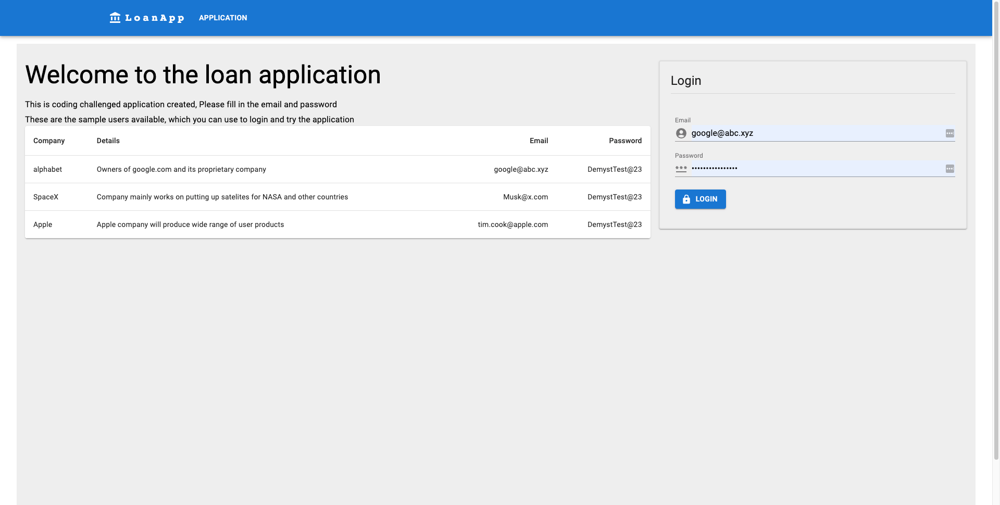
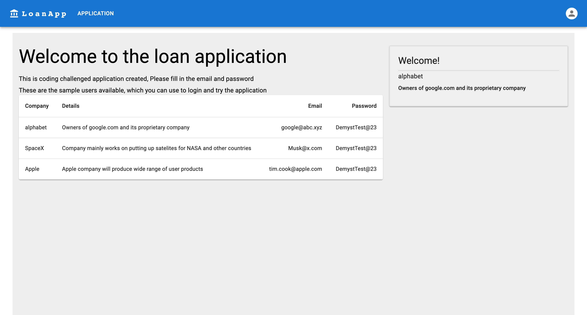
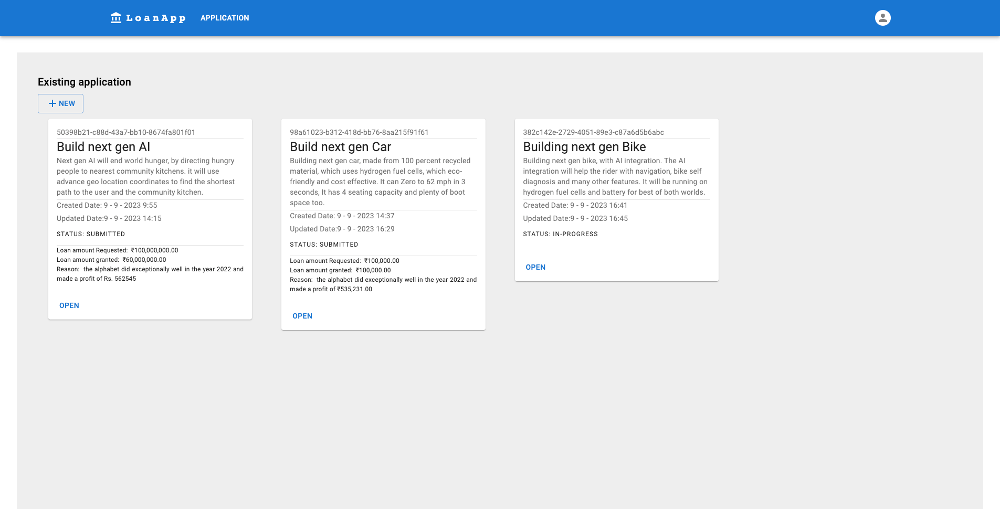
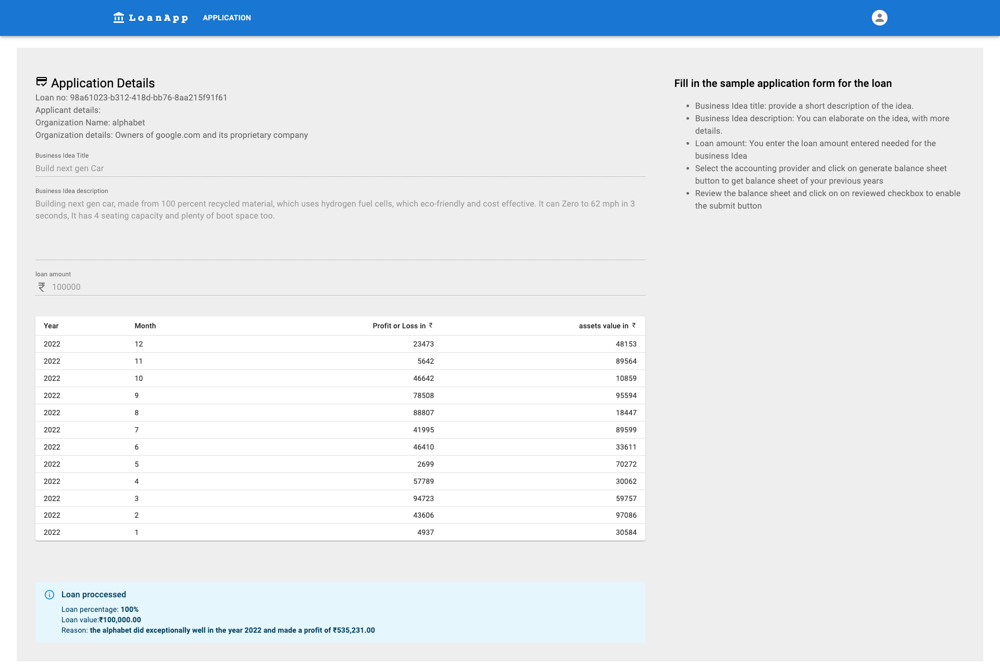
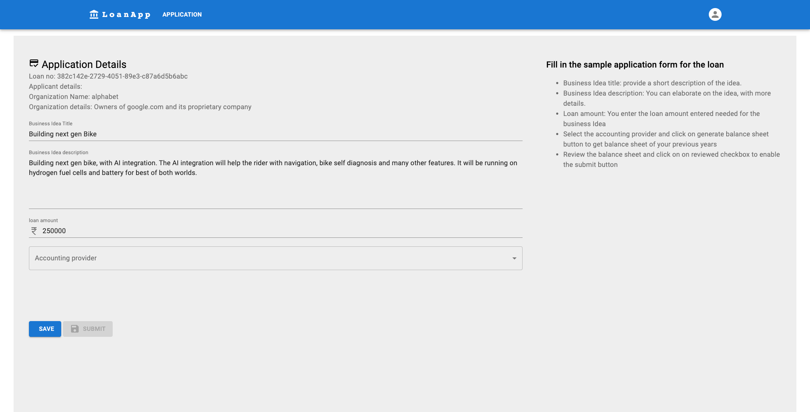

# demyst-coding-challenge

Coding challenge to test the coding skills of the candidate

## Table of Contents

- [About](#about)
- [Demo](#demo)
- [Features](#features)
- [Installation](#installation)

## About

The project aims to develop a straightforward system for processing business loan applications.

This system comprises two main components:

Frontend
Backend
The backend will establish connections with external service providers, including:

Decision engine: This component will receive the loan application and generate the application's result. (currently using mock data)
Accounting software providers: These providers will furnish the user with the balance sheet of the chosen business. (currently using mock data)

## Demo

Here are some sample screenshots of the live application







## Technology used

Frontend:

- `React` is used as client side framework
- `MUI` is used for the client side UI components
- Other React related liberaries such as `redux`, `react-router-dom` is used along with react to create a SPA
- `Webpack` is used for compiling the UI side of the code along with babel
- `axios` is used for making api calls to the backend

code for frontend is found under: `./client`

Backend:

- `Express` is used from creating API server for the backend
- `bcrypt` is used for password management
- `UUID` is used for generating unique application ids
- `cors` is added to handle cors related issues

code for backend is found under: `./server`

## Installation and running the application

```bash
# Clone the repository
git clone https://github.com/sachin-sn/demystCodingChallenge.git

# Change directory
cd demystCodingChallenge

# Install dependencies
npm install

# start the backend server
npm run startserver

# start the client
npm run start
```
